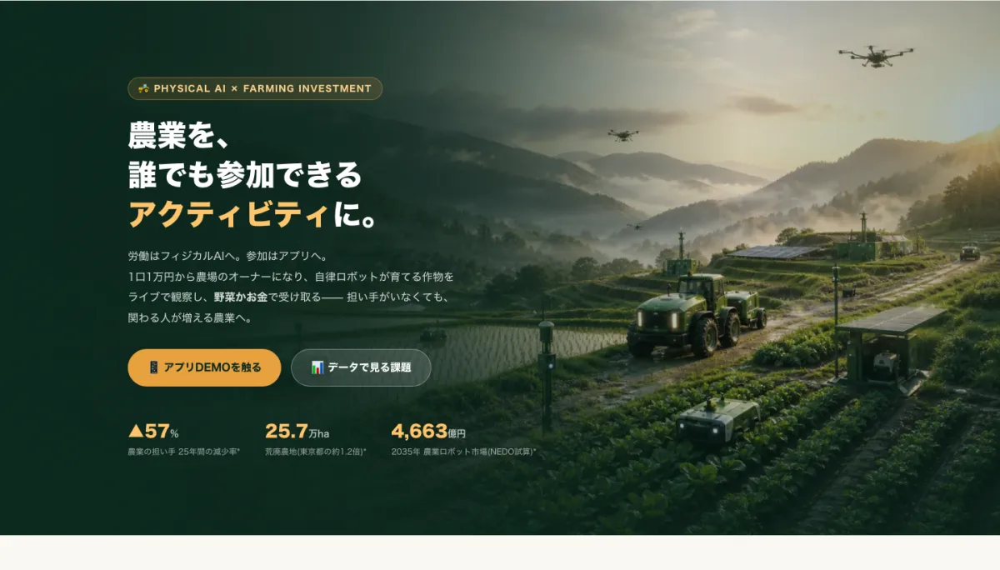
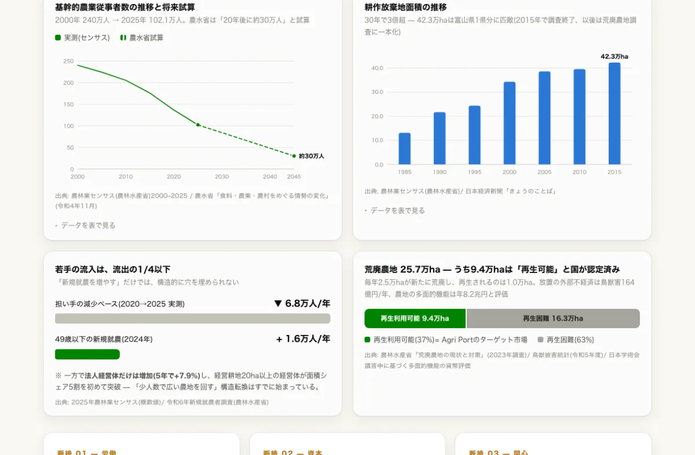
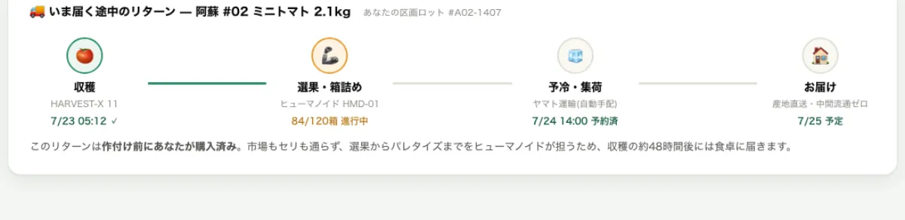
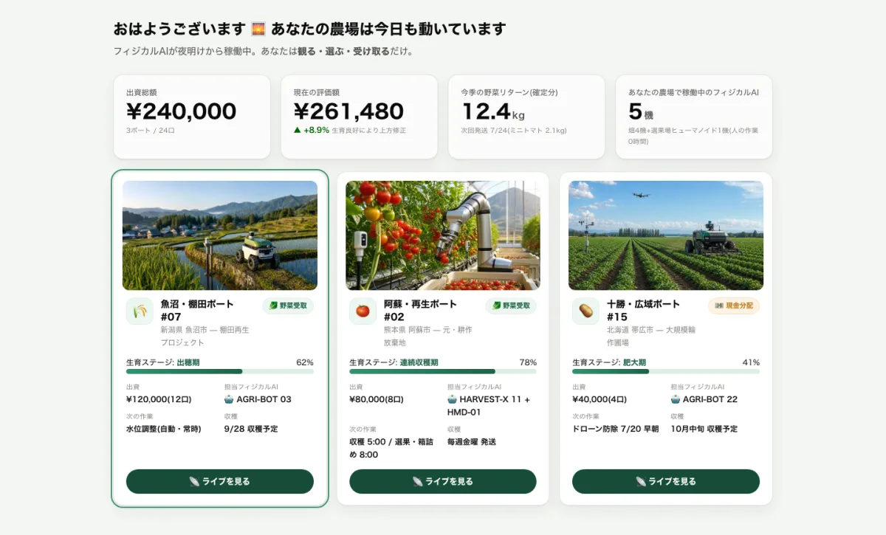
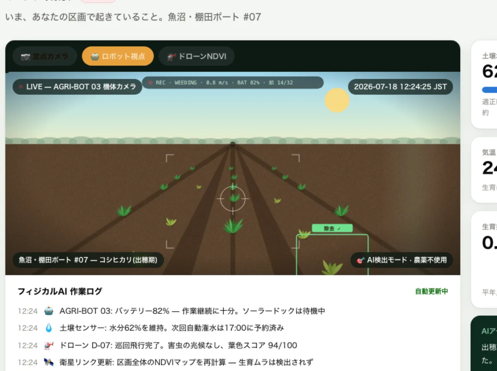
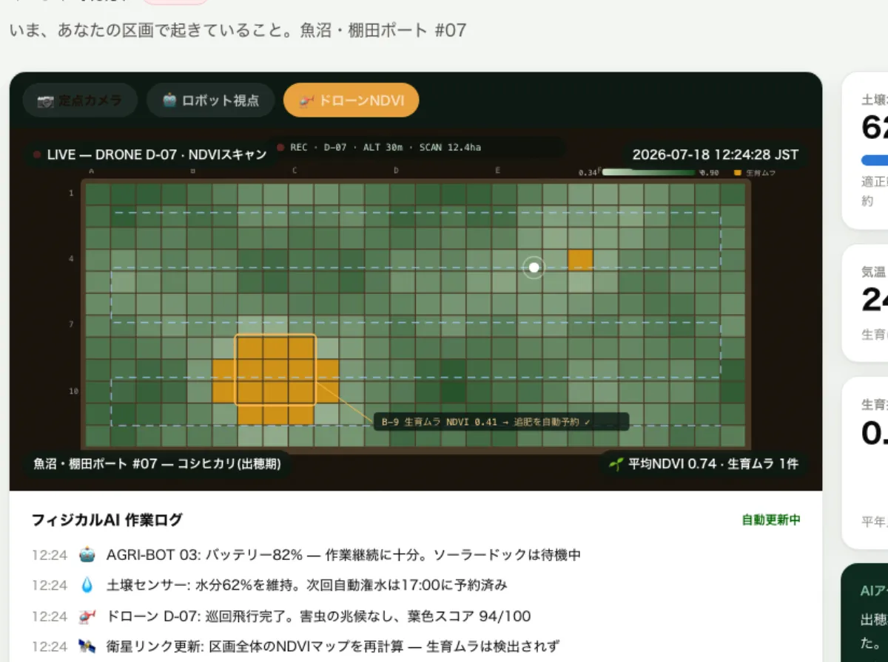

# 🌱 Agri Port — アプリDE農業

> **フィジカルAIが耕し、あなたが育てる。** 1口1万円から始める、観察型・投資型の参加農業プラットフォーム(ハッカソンDEMO)

**🌐 Live Demo: [agri-port.pages.dev](https://agri-port.pages.dev/)** — ランディング / **[アプリDEMO](https://agri-port.pages.dev/app.html)** — マイポート画面



---

## 何を解決するのか

日本の農業の課題は「人手不足」ではなく、**参加コストが極端に高い産業設計**にある — これがAgri Portの出発点です。一次統計が示す構造:

| 事実 | 数値 | 出典 |
|---|---|---|
| 基幹的農業従事者(25年間) | 240万人 → **102.1万人(▲57%)**、70歳以上が55% | 2025年農林業センサス(概数値) |
| 20年後の担い手(農水省試算) | **約30万人**(現在の約1/4) | 農水省 基本法検証資料(令和4年) |
| 若手の流入 vs 流出 | +1.6万人/年 vs **▲6.8万人/年**(1/4以下) | 新規就農者調査 / センサス |
| 荒廃農地 | **25.7万ha**(東京都の1.2倍)、うち9.4万haは再生可能と国が認定 | 農水省 荒廃農地調査(2023) |
| 市場流通での生産者の手取り | 小売価格の**48.5%**(直販なら71.8〜78.5%) | 農水省 食品流通段階別価格形成調査(令和4年度) |
| トラック輸送能力(2030年度) | **▲34.1%**(物流2024年問題) | NX総研試算 / 食料・農業・農村白書 |



## ソリューション — 3つの断絶を再接続する

| 断絶 | Agri Portの答え |
|---|---|
| **労働**(現地に住む身体が前提) | フィジカルAI艦隊が耕作を代替 — 自律トラクタ / 収穫ロボ(RaaS) / ドローン / AI潅水。**選果・箱詰め等の収穫後工程はヒューマノイド**(野菜・果樹の労働時間の最大の塊はここ: ねぎ49%・いちご35%) |
| **資本**(都市の資金が農地に流れない) | 1口¥10,000の小口参加。農地は所有せず**リース方式**(2009年農地法改正で自由化)で農地法の壁を回避 |
| **関心**(就農か無関係かの二択) | アプリで**ライブ観察** — 推し農場をオブザーブする中間的な関わり方を発明 |

### リターンは野菜でも、お金でも(2トラック規制設計)

- **Track A 🥬 野菜リターン** — 前払購入契約として設計 = **金商法の対象外**。登録不要で即日スタート可能(MVP)
- **Track B 💴 金銭リターン** — 匿名組合出資。第二種金融商品取引業者と提携してスケール期に解禁

### 売れてから、作る

出資=前払購入なので**作付け前に完売**している。市場もセリも通らないため、中抜きされていた約30ポイントの流通マージンがリターンと地域の原資に変わり、豊作は「暴落」ではなく「上振れ」になる。



## アプリDEMOの見どころ

**[app.html](https://agri-port.pages.dev/app.html)** で体験できます:



### カメラ3視点のライブ観察

「人間は畑にいないのに、AIが何を見て何を判断しているかを観察できる」— このプロダクトの核心です。

| 📷 定点カメラ | 🤖 ロボット視点 | 🚁 ドローンNDVI |
|---|---|---|
| 畑を巡回する自律ロボとドローン(アニメーション) | AI雑草検出ボックスがリアルタイム表示(雑草 0.93 → 除去 ✓) | 生育マップをスキャン、生育ムラを検出して追肥を自動予約 |




ほかに: フィジカルAI作業ログの自動更新 / リターン切替(野菜⇄お金) / 耕作放棄地再生ポートへの出資体験。

## 技術構成

- **ビルド不要の静的サイト**(vanilla HTML/CSS/JS)— ハッカソン本番で壊れない
- チャートは自作の軽量SVGライブラリ(`assets/charts.js`)— クロスヘア+ツールチップ、表表示、CVD配色検証済み
- ライブシーンはSVGを手続き生成(`assets/scenes.js`)— 検出ボックス、NDVIセルマップ、テレメトリHUD
- 画像はAI生成(PNG原本: `assets/images/`)+ WebP最適化版(`assets/images/optimized/`、各100〜330KB)
- デプロイ: Cloudflare Pages(mainへのpushで自動デプロイ、ビルドコマンドなし)

```bash
# ローカルで見る
open index.html        # または python3 -m http.server
```

## ロードマップ 2026 → 2035

| Phase | 期間 | 内容 | KPI |
|---|---|---|---|
| 0 | 2026 | パイロットポート(このDEMO)— 野菜リターンのみで法的リスクなく検証 | 1ポート / 参加者300人 |
| 1 | 2027–28 | ポート網形成、ふるさと納税連携、AI艦隊の多ポート巡回 | 10ポート / 再生農地50ha |
| 2 | 2029–31 | 二種業提携で投資型解禁、荒廃農地再生ファンド | 100ポート / 再生農地1,000ha |
| 3 | 2032–35 | 全国1,000ポート — 担い手30万人時代に**関わる人1,000万人**の農業へ | 再生農地1万ha |

## データの出典

統計はすべて一次ソースに基づき、サイト内の各チャート・各セクション直下に出典を明記しています: 農林水産省(農林業センサス2025概数値 / 農業構造動態調査 / 新規就農者調査 / 荒廃農地の現状と対策 / 食品流通段階別価格形成調査 / 食料・農業・農村基本計画)、NEDO、矢野経済研究所、NX総合研究所、Goldman Sachs Research、Euronews ほか。

---

> ⚠️ 本プロジェクトはハッカソン用のデモンストレーションです。記載のサービス・分配率・募集はすべて架空であり、金融商品の勧誘ではありません。画像はAI生成によるイメージです。
